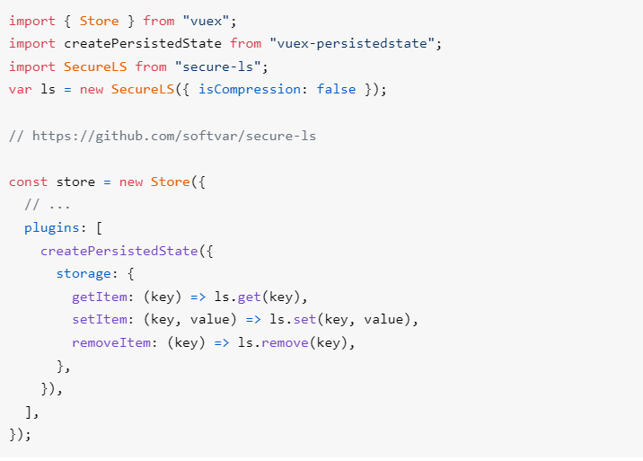

# BookLike Uygulaması

**Bu uygulamada neler yaptık?**
* Temayı componentlere ayırma
* Vue router projeye dahil edildi 
* Fake API'nin projeye dahil edilmesi
* Axios'un projeye dahil edilmesi ve custom axios oluşturulması
* Register -> CryptoJS ile kullanıcının şifresini şifreleme
* Login olan kullanıcının state üzerinde tutulması
* Login işlemine göre appHeader'ın düzenlenmesi
* vuex persistedstate paketinin projeye dahil edilmesi
* SecureLS paketinin projeye dahil edilmesi
* Route üzerinden authentication kontrolü

## Composition API Nedir?

*Options API'da computed, watch kullanıyorduk ve burada reactivity uygulama büyüdükçe yük bindirmeye başlıyordu*

*Sayfamda diyelim 20bin'den fazla reactivity değişken var. Yine performanslı çalışır ancak sıkıntı çıkarabilir*

*Composition API reactivity'i belirlememize imkan tanıyor*


## Projeye Dahil Edilen Paketlerin Terminal Kodları

* vou-router : 
````
npm install vue-router@4
````

* fake api
````
npx json-server db.json
````

* axios
````
npm install axios
````
* crypto.js
````
npm install crypto-js
````
* vuex
````
npm install vuex@next
````
* vuex persistedstate

*Vuex persistedstate dokümantasyonu için [tıklayınız](https://www.npmjs.com/package/vuex-persistedstate)*

````
npm install --save vuex-persistedstate
````

* secureLS

*secureLS ile local storage'da tuttuğumuz verileri çin alfabesi gibi anlaşılamaz şekilde tutabiliyoruz*

*SecureLS dokümantasyonu için [tıklayınız](https://github.com/softvar/secure-ls)*

*SecureLS'i Vuex persistedstate ile kullanma dokümantasyonu için [tıklayınız](https://www.npmjs.com/package/vuex-persistedstate)*

````
npm install secure-ls
````

## Authenticated durumuna göre component manipülasyonu

*Vuex store'da authenticated durumunu saklayıp, componentte mapGetters ile bu durumu getirip eğer authenticated olunmuşsa ona göre v-if ile componentte element getirebiliyoruz.*


* Örnek olarak Home.vue ile appHeader'da navbarda bazı elementler login olma durumuna göre getiriliyor.

### Login.vue
````html
<template>
    <div class="login_register_container">
      <h3 class="text-2xl text-center mb-3">Login</h3>
      <input type="text" v-model="userData.username" placeholder="Kullanıcı Adı" class="input mb-3" />
      <input type="password" v-model="userData.password" placeholder="Şifre" class="input mb-3" />
      <button class="default-button" @click="onSubmit">Giriş yap</button>
      <span class="text-center mt-3 text-sm">
        Üye değilim,
        <router-link :to="{name : 'RegisterPage'}" class="text-red-900 hover:text-black">
          Üye olmak istiyorum!
        </router-link>
        
      </span>
    </div>
</template>
<script>
import CryptoJS from "crypto-js";

export default {
  data(){
    return{
      userData:{
        username:null,
        password:null,
      }
    }
  },
  methods:{
    onSubmit(){
      const password = CryptoJS.HmacSHA1(this.userData.password, this.$store.getters._saltKey).toString();
      //console.log(password);
      this.$appAxios.get(`/users?username=${this.userData.username}&password=${password}`)
      .then(login_response =>{
        console.log('login_response', login_response);
        if(login_response?.data?.length > 0){
          this.$store.commit("setUser",login_response?.data[0]);
          this.$router.push({name:"HomePage"});
        }else{
          alert("Böyle bir kullanıcı bulunmamaktadır...");
        }
        
      })
      .catch(e=> console.log('e', e));
      //.finally(()=>this.loader=false);

    }
  }
}
</script>

````


### appHeader.vue
* app Header Home.vue içindeki child componenttir.

````html
<template>
    <div class="header-container">
      <nav class="flex w-full px-2">
        <div class="flex text-xl">
          <svg xmlns="http://www.w3.org/2000/svg" class="fill-current mr-2" height="36" viewBox="0 0 24 24" width="36">
            <path d="M0 0h24v24H0V0z" fill="none" />
            <path d="M4 6H2v14c0 1.1.9 2 2 2h14v-2H4V6zm16-4H8c-1.1 0-2 .9-2 2v12c0 1.1.9 2 2 2h12c1.1 0 2-.9 2-2V4c0-1.1-.9-2-2-2zm-3 2v5l-1-.75L15 9V4h2zm3 12H8V4h5v9l3-2.25L19 13V4h1v12z" />
          </svg>
          BookLike
        </div>


        <div v-if="_isAuthenticated" class="ml-auto flex items-center">
          <router-link :to="{ name:'NewBookmarkPage'}" class="flex bg-gray-700 hover:bg-black text-white px-3 py-1 rounded-sm text-sm items-center mr-2">
            <svg xmlns="http://www.w3.org/2000/svg" class="fill-current" height="16" viewBox="0 0 24 24" width="16">
              <path d="M0 0h24v24H0V0z" fill="none" />
              <path d="M19 13h-6v6h-2v-6H5v-2h6V5h2v6h6v2z" />
            </svg>
            Yeni
          </router-link>
          <div class="relative group">
            <button class="w-8 h-8 flex items-center justify-center rounded-md transition-colors duration-500 hover:bg-gray-200 group-focus-within:bg-gray-300">
              <svg xmlns="http://www.w3.org/2000/svg" height="24" viewBox="0 0 24 24" class="fill-current" width="24">
                <path d="M0 0h24v24H0V0z" fill="none" />
                <path d="M12 8c1.1 0 2-.9 2-2s-.9-2-2-2-2 .9-2 2 .9 2 2 2zm0 2c-1.1 0-2 .9-2 2s.9 2 2 2 2-.9 2-2-.9-2-2-2zm0 6c-1.1 0-2 .9-2 2s.9 2 2 2 2-.9 2-2-.9-2-2-2z" />
              </svg>
            </button>
            <nav class="bg-white !z-10 rounded-md shadow-md p-2 w-56 flex flex-col absolute group-focus-within:visible top-full right-0 invisible">
              <a href="#" class="mb-2 menu-item">
                <svg xmlns="http://www.w3.org/2000/svg" height="24" class="fill-current mr-1" viewBox="0 0 24 24" width="24">
                  <path d="M0 0h24v24H0V0z" fill="none" />
                  <path d="M12 2C6.48 2 2 6.48 2 12s4.48 10 10 10 10-4.48 10-10S17.52 2 12 2zM7.07 18.28c.43-.9 3.05-1.78 4.93-1.78s4.51.88 4.93 1.78C15.57 19.36 13.86 20 12 20s-3.57-.64-4.93-1.72zm11.29-1.45c-1.43-1.74-4.9-2.33-6.36-2.33s-4.93.59-6.36 2.33C4.62 15.49 4 13.82 4 12c0-4.41 3.59-8 8-8s8 3.59 8 8c0 1.82-.62 3.49-1.64 4.83zM12 6c-1.94 0-3.5 1.56-3.5 3.5S10.06 13 12 13s3.5-1.56 3.5-3.5S13.94 6 12 6zm0 5c-.83 0-1.5-.67-1.5-1.5S11.17 8 12 8s1.5.67 1.5 1.5S12.83 11 12 11z" />
                </svg>
                Account
              </a>
              <a href="#" class="mb-2 menu-item">
                <svg xmlns="http://www.w3.org/2000/svg" class="fill-current mr-1" height="24" viewBox="0 0 24 24" width="24">
                  <path d="M0 0h24v24H0V0z" fill="none" />
                  <path d="M15 7v12.97l-4.21-1.81-.79-.34-.79.34L5 19.97V7h10m4-6H8.99C7.89 1 7 1.9 7 3h10c1.1 0 2 .9 2 2v13l2 1V3c0-1.1-.9-2-2-2zm-4 4H5c-1.1 0-2 .9-2 2v16l7-3 7 3V7c0-1.1-.9-2-2-2z" />
                </svg>
                Favorites</a
              >
              <a href="#" class="menu-item">
                <svg xmlns="http://www.w3.org/2000/svg" enable-background="new 0 0 24 24" class="fill-current mr-1" height="24" viewBox="0 0 24 24" width="24">
                  <g><path d="M0,0h24v24H0V0z" fill="none" /></g>
                  <g><path d="M17,8l-1.41,1.41L17.17,11H9v2h8.17l-1.58,1.58L17,16l4-4L17,8z M5,5h7V3H5C3.9,3,3,3.9,3,5v14c0,1.1,0.9,2,2,2h7v-2H5V5z" /></g>
                </svg>
                Logout</a
              >
            </nav>
          </div>
        </div>
      </nav>
    </div>
</template>

<script>
import { mapGetters } from 'vuex';
export default {
  computed:{
    ...mapGetters(["_isAuthenticated"])
  }
}

</script>
````
### index.js vuex store 
````js
import { createStore } from "vuex";

export default createStore({
    state :{
        user:null,
        saltKey:"booklike123!456?"
    },
    mutations:{
        //userı set edecek
        setUser(state,user){
            state.user= user;
        }

    },
    getters:{
        _isAuthenticated : state => state.user != null,
        _getCurrentUser(state){
            const user =state.user;
            delete user?.password;
            return user;
        },
        _saltKey: state=> state.saltKey,
    },
    
}) 

````

### Authenticated olan kullanıcının verilerini gizlemek için Vuex Persistedstate ve SecureLS'in Vuex'e implemente edilmesi

* vuex persistedstate ile local storage'da vuex içinde giriş yapan kullanıcının datasını tutabiliyoruz.
* secureLS ile bu datayı hashliyoruz.

<!--  -->





````js
import { createStore } from "vuex";
import createPersistedState from "vuex-persistedstate";
import SecureLS from "secure-ls";
var ls = new SecureLS({ isCompression: false });

export default createStore({
  state: {
    user: null,
    saltKey: "booklike123!456?",
  },
  mutations: {
    //userı set edecek
    setUser(state, user) {
      state.user = user;
    },
  },
  getters: {
    _isAuthenticated: (state) => state.user != null,
    _getCurrentUser(state) {
      const user = state.user;
      delete user?.password;
      return user;
    },
    _saltKey: (state) => state.saltKey,
  },
  plugins: [
    createPersistedState({
      key: "user",
      storage: {
        getItem: (key) => ls.get(key),
        setItem: (key, value) => ls.set(key, value),
        removeItem: (key) => ls.remove(key),
      },
    }),
  ],
});


````

## Route üzerinde Authentication Kontrolü

* Buradaki amaç login olduktan sonra yönlendirdiğimiz sayfaya gitmeden önce authenticated olup olmadığını bilmek istememizden geliyor.

### router/index.js

````js

import { createRouter, createWebHashHistory } from "vue-router";
import store from "../store";

const routes=[
    {
        name:"HomePage",
        path: "/",
        component : ()  => import("@/views/Home.vue")
    },
    {
        name:"LoginPage",
        path: "/login",
        component : ()  => import("@/views/Login.vue")
    },
    {
        name:"RegisterPage",
        path: "/register",
        component : ()  => import("@/views/Register.vue")
    },
    {
        name:"NewBookmarkPage",
        path: "/new",
        component : ()  => import("@/views/NewBookmark.vue")
    },
];
const router = createRouter({
    routes,
    history: createWebHashHistory()
});


router.beforeEach((to, next)=>{
    const authRequiredRoutes =["HomePage"];
    const authNotRequiredRoutes =["LoginPage","RegisterPage"];
    const _isAuthenticated= store.getters._isAuthenticated;

    if(authNotRequiredRoutes.indexOf(to.name) > -1 && _isAuthenticated) next(false); //login olduktan sonra LoginPage ve RegisterPage'e yönlendirmiyor


    if(authRequiredRoutes.indexOf(to.name) > -1 )
    {
        if(_isAuthenticated) next(); // eğer authenticated olduysa next deyip devam edecek
        else next({name:"LoginPage"}); //eğer authenticated olmadıysa logine yönlendiriyoruz
    }else{
        next();
    }

});
export default router;

````

